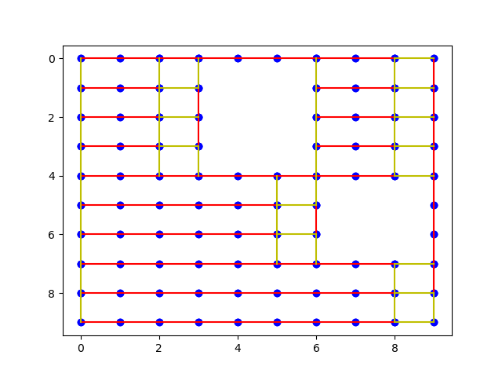
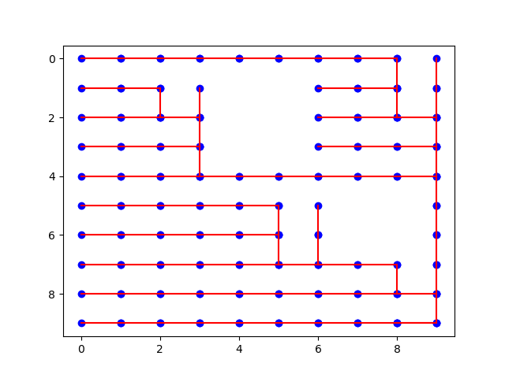

# OptimalCoveragePathPlanningProblem

## Prerequisites

### Python

```bash
pip install numpy
pip install matplotlib
pip install scipy
pip install pandas
```

### Matlab

Optimization Toolbox(https://www.mathworks.com/help/optim/)

### GNU C

gcc 11.3.0

**Disclaimer**:

All code from folder GLKH-1.1 is not original. Everything is based on http://webhotel4.ruc.dk/~keld/research/GLKH/ with only changes being compatibility changes in the original code to run on the current setup. If you want to use the original GLKH follow the download instructions on the website and replace GLKH-1.1 with the compiled folder.

**Note**:

If you are running this on Windows OS mingw compiler is tested and doesn't work. GLKH is ported to this version of gcc with cygwin 3.3.5 and is primarily tested and run on this version.

## Code workings

### Run unfinished GTSP version

Go to the bottom of OCPPP.py
Change desired start, end and unpassable areas or read a .csv file which is a heat map
Which can be changed in the section
```bash
g = Grid(start = start10, end = end10, unpassable = unpassable10, threshold = 0)
g = Grid(csv_file=csv_file, threshold=0)
```
Change mode = 0
```bash
python OCPPP.py
```
Go to Matlab command line and the main repository directory
```bash
OCPPP
```
The following xh.csv would be the results of line segmentation of the workspace
Go back to OCPPP.py and change mode = 1, activate_tsp = 0
```bash
python OCPPP.py
```
Creates the transition segments and relative cost for GTSP and plots the line segments to segment.png
Go to Matlab again
```bash
GTSP
```
The following GTSP_result.csv would be the results of GTSP w.r.t the line segments and transition segments
To plot the results go back to OCPPP.py again and change mode = 2
```bash
python OCPPP.py
``` 
#### plot
Go back to the bottom of OCPPP.py
Change mode = 2
```bash
python OCPPP.py
```

### Run with Ramesh et al. configurations

Go to the bottom of OCPPP.py
Change desired start, end and unpassable areas or read a .csv file which is a heat map.
Edit the section bellow accordingly at the bottom of OCPPP.py
```bash
g = Grid(start = start10, end = end10, unpassable = unpassable10, threshold = 0)
g = Grid(csv_file=csv_file, threshold=0)
```bash
Change mode = 0
```bash
python OCPPP.py
```
Go to Matlab command line and the main repository directory
```bash
OCPPP
```
The following xh.csv would be the results of line segmentation of the workspace
Go back to OCPPP.py and change mode = 1, activate_tsp = 1
```bash
python OCPPP.py
```
You would get the files
```bash
edge_weight_section.txt
set_section.txt
```
These files would be used to create the .gtsp file for GLKH. a template .gtsp used is OCPPP3.gtsp.

Open .gtsp file with text editor

Change the tags accordingly. The important ones are replace content under EDGE_WEIGHT_SECTION tag with the contents from edge_weight_section.txt and replace GTSP_SET_SECTION tag contents with content from set_section.txt.

Then change the DIMENSION and GTSP_SETS to match that of GTSP_SET_SECTION.

Don't forget to change the NAME tag to the filename of the .gtsp file.

(I know this is very annoying and I promise I will include code to do this automatically on the next update QwQ)

After the .gtsp file is saved copy to GLKH-1.1/GTSPLIB run GLKH
```bash
cp (filename).gtsp GLKH-1.1/GTSPLIB
cd GLKH-1.1
./runGLKH (filename without .gtsp at the end)
```
Your results should be saved in the following format
```bash
(filename).(optimal cost).tour
```
To compile the results the file
```bash
line_segment.mat
```
Contains a dictionary with the set number defined in GLKH to the line segment and direction with the set number as the key and line segment as the value.
Then you can find the resulting trajectory when you match the results together.

## test result
the other files are the results using
```bash
unpassable = [[1, 4], [2, 4], [3, 4], [1, 5], [2, 5], [3, 5], [5, 7], [5, 8], [6, 7], [6, 8]]
```


Fig.1 result of workspace segmentation(red lines) and transition segments(yellow lines)



Fig.2 result of GTSP

## Reference:
[1] Stanislav Bochkarev and Stephen L. Smith. On minimizing turns in robot coverage path planning. 2016 IEEE
International Conference on Automation Science and Engineering (CASE), pp. 1237–1242, 2016.
[2] Megnath Ramesh, Frank Imeson, Baris Fidan, and Stephen L. Smith. Optimal Partitioning of Non-Convex Environments
for Minimum Turn Coverage Planning. 2021.
[3] Keld Helsgaun. Solving the equality generalized traveling salesman problem using the Lin--Kernighan--Helsgaun
Algorithm. Mathematical Programming Computation, 7, pp. 269–287, 2015.
